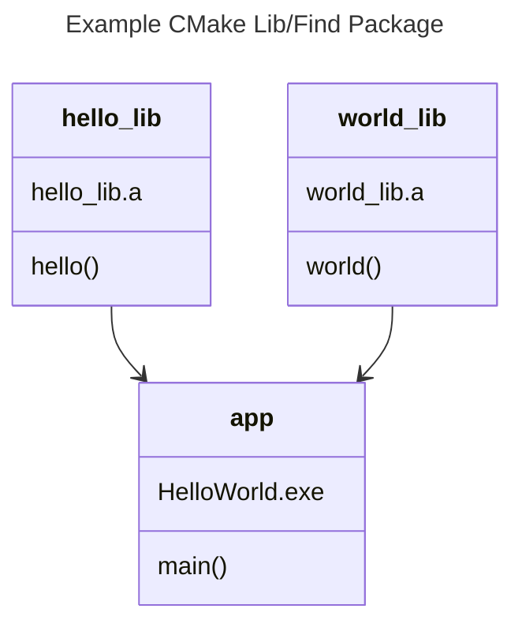

# Boiler plate CMake reference

A CMake reference of compiling sepperate static libs and bringing them in via `find_package`

```mermaid
---
title: Example CMake Lib/Find Package
---
classDiagram
app : main()
app : HelloWorld.exe
hello_lib : hello()
hello_lib : hello_lib.a
hello_lib -->app
world_lib : world()
world_lib : world_lib.a
world_lib -->app
```
