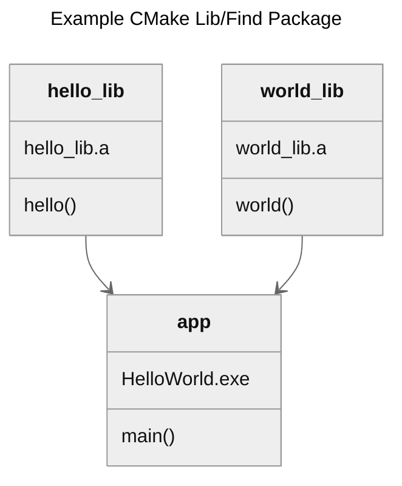

# Boiler plate CMake reference

[](https://github.com/NateZimmer/cmake_reference/actions/workflows/ci_linux.yml) [](https://github.com/NateZimmer/cmake_reference/actions/workflows/ci_win.yml)

A CMake reference of compiling sepperate static libs and bringing them in via `find_package`



### Build Win/Linux

```bash
# Kick of top level cmake build of sub projects
cmake -B out
cmake --build out
```


### Notes 

Yes, while this project is silly for hello world, this type of library style assits in much larger scale projects.  

